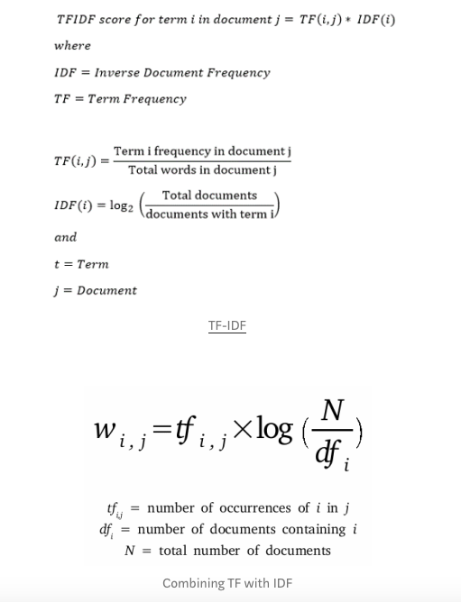
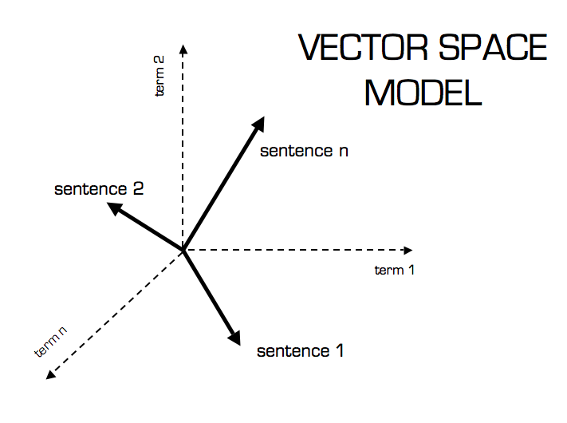

[MadeWithML Incubator](https://madewithml.com/incubator/ )

The MWML Data Science Incubator is a non-profit and community-led effort to create a meaningful summer experience for students who lost their summer in-person internship opportunities due covid-19 and also for aspiring data scientists.

This is a team work of high school senior Sanjay Mohandas and aspiring data scientist Mohandas Mariappan.

Through this incubator, we learned a lot about data science & cloud concepts. Also how to build, test & deploy an end-to-end interactive ML dashboard.

A big thanks to the Summer 2020 MadeWithML Data Science Incubator for providing us with an opportunity to learn more skills, build applications, and share our work.

This is an end-to-end interactive dashboard which deals with the TheMoviesDataset. It serves to build movie recommendations, movie classifications and exploratory analysis etc.

- Summer 2020 MadeWithML Data Science Incubator Team Name : MoMo Movies
- Team Members:
    - Sanjay Mohandas
    - Mohandas Mariappan

- Click here to access the application >> [MoMo Movies](https://momomovies.herokuapp.com)

We picked "The Movies Dataset" and built the following:

# Content-Based Recommendation Model
- Content based recommendation model separated into 2 categories
    - Genre
    - Keywords

    This model is a Content Based Recommendation model that is seperated into 2 categories: genre and keywords. The model uses the concepts of Term Frequency (TF) and Inverse Document Frequency (IDF) to determine the relative importance of the genre or keyword. After calculating the TF-IDF values, in order to see how similar items are to each other, we used vector space modeling. Each item is stored as a vector, and the similarity can be correlated with the proximity between any two vectors. The proximity is found by taking the angle between the vectors. Then, using the TF-IDF scores and the vector space model, we can create a dot product that gives the value of the cosine similarity score. This score is a number than can be directly used to find the similarity between two movies. Through all that math and logic we successfully created a content based recommendation model that returns 10 similar movies based off a given movie the user chooses. Depending on what content based recommendation system the user picks, the 10 movies can be similar based off genre, or the keywords of the chosen movie.

    
    

# Exploratory Analysis of TheMoviesDataset
- Exploratory Analysis:
  - Average rating analysis
  - Profit analysis by genre
  - Runtime analysis by genre
  - Genre Word Cloud by # of Movies
  - Word Cloud by Words From Movie Titles
  - Movies Released In Each Decade

# SUMMARY OF THE DATASET 
================================================================================

These files contain 1,00,000 anonymous ratings of approximately 5,375 movies 
made by 671 TheMoviesDatset users.

# USAGE LICENSE
================================================================================

Neither the Sanjay Mohandas nor Mohandas Mariappan involved in this research can guarantee the correctness of the data, its suitability for any particular purpose, or the validity of results based on the use of the data set.  The data set may be used for any research
purposes under the following conditions:

     * The user may not state or imply any endorsement from the
       Sanjay Mohandas or Mohandas Mariappan.

     * The user must acknowledge the use of the data set in
       publications resulting from the use of the data set
       from Kaggle Movies Dataset.

     * The user may not redistribute the data without separate
       permission.

If you have any further questions or comments, please contact
<mohandasnj@gmail.com> and/or sunmohandas@gmail.com. 
